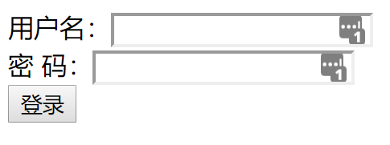

# Servlet

## Servlet的作用

Servlet带给我们最大的作用就是能够**处理浏览器带来HTTP请求，并返回一个响应给浏览器，从而实现浏览器和服务器的交互**。

## JAVAWEB目录结构


- bbs目录代表一个web应用
- bbs目录下的html,jsp文件可以直接被浏览器访问
- **WEB-INF目录下的资源是不能直接被浏览器访问的**
- web.xml文件是web程序的主要配置文件
- 所有的classes文件都放在classes目录下
- jar文件放在lib目录下

## Servlet生命周期

1. **加载Servlet**。

   当Tomcat第一次访问Servlet的时候，**Tomcat会负责创建Servlet的实例**

2. **初始化**。

   当Servlet被实例化后，Tomcat会**调用init()方法初始化这个对象**

3. **处理服务**。

   当浏览器**访问Servlet**的时候，Servlet **会调用service()方法处理请求**

4. **销毁**。

   当Tomcat关闭时或者检测到Servlet要从Tomcat删除的时候会自动调用destroy()方法，**让该实例释放掉所占的资源**。一个Servlet如果长时间不被使用的话，也会被Tomcat自动销毁

5. **卸载**。

   当Servlet调用完destroy()方法后，等待垃圾回收。如果**有需要再次使用这个Servlet，会重新调用init()方法进行初始化操作**。

> 只要访问Servlet，service()就会被调用。

> init()只有第一次访问Servlet的时候才会被调用。

> destroy()只有在Tomcat关闭的时候才会被调用。


## 过程方法

- Servlet 通过调用 **init ()** 方法进行初始化。
- Servlet 调用 **service()** 方法来处理客户端的请求。
- Servlet 通过调用 **destroy()** 方法终止（结束）。
- 最后，Servlet 是由 JVM 的垃圾回收器进行垃圾回收的。

### init() 方法

init 方法被设计成只调用一次。它在第一次创建 Servlet 时被调用，在后续每次用户请求时不再调用。因此，它是用于一次性初始化

Servlet 创建于用户第一次调用对应于该 Servlet 的 URL 时，但是您也可以指定 Servlet 在服务器第一次启动时被加载。

当用户调用一个 Servlet 时，就会创建一个 Servlet 实例，每一个用户请求都会产生一个新的线程，适当的时候移交给 doGet 或 doPost 方法。

init() 方法简单地创建或加载一些数据，这些数据将被用于 Servlet 的整个生命周期。

```java
public void init() throws ServletException {
  // 初始化代码...
}
```

### service() 方法

service() 方法是执行实际任务的主要方法。

Servlet 容器（即 Web 服务器）调用 service() 方法来处理来自客户端（浏览器）的请求，并把格式化的响应写回给客户端。

每次服务器接收到一个 Servlet 请求时，服务器会产生一个新的线程并调用服务。

service() 方法检查 HTTP 请求类型（GET、POST、PUT、DELETE 等），并在适当的时候调用 doGet、doPost、doPut，doDelete 等方法。

```java
public void service(ServletRequest request, 
                    ServletResponse response) 
      throws ServletException, IOException{
}
```

service() 方法由容器调用

service 方法在适当的时候调用 doGet、doPost、doPut、doDelete 等方法

只需要根据来自客户端的请求类型来重写 doGet() 或 doPost() 即可

doGet() 和 doPost() 方法是每次服务请求中最常用的方法。下面是这两种方法的特征

#### doGet() 方法

GET 请求来自于一个 URL 的正常请求，或者来自于一个未指定 METHOD 的 HTML 表单，它由 doGet() 方法处理。

```java
public void doGet(HttpServletRequest request,
                  HttpServletResponse response)
    throws ServletException, IOException {
    // Servlet 代码
}
```

#### doPost() 方法

POST 请求来自于一个特别指定了 METHOD 为 POST 的 HTML 表单，它由 doPost() 方法处理。

```java
public void doPost(HttpServletRequest request,
                   HttpServletResponse response)
    throws ServletException, IOException {
    // Servlet 代码
}
```

### destroy() 方法

destroy() 方法只会被调用一次，在 Servlet 生命周期结束时被调用

destroy() 方法可以让您的 Servlet 关闭数据库连接、停止后台线程、把 Cookie 列表或点击计数器写入到磁盘，并执行其他类似的清理活动

在调用 destroy() 方法之后，servlet 对象被标记为垃圾回收

```java
  public void destroy() {
    // 终止化代码...
  }
```

## 典型的 Servlet 生命周期方案。

- 第一个到达服务器的 HTTP 请求被委派到 Servlet 容器。
- Servlet 容器在调用 service() 方法之前加载 Servlet。
- 然后 Servlet 容器处理由多个线程产生的多个请求，每个线程执行一个单一的 Servlet 实例的 service() 方法。


## Servlet 内部请求过程


请求说明：

一个请求Request进来经过前端控制器Dispatcher Servlet，这是前端的核心。

一个请求的URL进来，经过Dispatcher Servlet转发，首先转发到Handler Mapping，

②Handler Mapping的作用就是完成对URL到Controller组件的映射，

然后通过Dispatcher Servlet从Handlermapping查找处理request的Controller。

③ controller处理request请求后并返回ModelAndView对象，

Controller是springmvc中负责处理request的组件，ModelAndView是封装结果视图的组件。其后面的步骤就是将视图结果返回给客户端。

总结：上图除了Dispatcherservlet以外其他的都是相互独立，所有请求都经过这个核心控制器进行转发控制。   

## Servlet 实例

```java
// 导入必需的 java 库
import java.io.*;
import javax.servlet.*;
import javax.servlet.http.*;

// 扩展 HttpServlet 类
public class HelloWorld extends HttpServlet {
 
  private String message;

  public void init() throws ServletException
  {
      // 执行必需的初始化
      message = "Hello World";
  }

  public void doGet(HttpServletRequest request,
                    HttpServletResponse response)
            throws ServletException, IOException
  {
      // 设置响应内容类型
      response.setContentType("text/html");

      // 实际的逻辑是在这里
      PrintWriter out = response.getWriter();
      out.println("<h1>" + message + "</h1>");
  }
  
  public void destroy()
  {
      // 什么也不做
  }
}
```

## Servlet Web 实例

##### web.xml中的配置 

```xml
<servlet>  
     <servlet-name>LoginServlet</servlet-name>                               
     <servlet-class>com.servlet.LoginServlet</servlet-class>            
</servlet>  
<servlet-mapping>  
     <servlet-name>LoginServlet</servlet-name>                                
       <url-pattern>login.html</url-pattern>                                                   
</servlet-mapping>  
```

##### 前端页面

```HTMl

<!DOCTYPE html>
<html>
<head>
	<title>登录</title>
	<meta charset="utf-8">
</head>
<body>
    <form action="login.html" method = "post">
      用户名：<input type="text"name = "userName"><br>
      密  码：<input type="password"name = "password"><br>
      <input type="submit" value="登录">
     </form>
</body>	
</html>
```



##### 点击登录按钮后，提交表单.

首先匹配*web.xml*中的路径，找到*<url-pattern>*值是*login*。*html*的*sevlet*，然后根据*name*去匹配*servlet*类，找到*LoginServlet*。LoginServlet.java文件

```java

public class LoginServlet extends HttpServlet implements Servlet {  
    @Override  
    protected void doGet(HttpServletRequest request,  
            			 HttpServletResponse response) 
        			throws ServletException, IOException {  
        doPost(request, response);  
    }  
  
    @Override  
    protected void doPost(HttpServletRequest request,  
           				  HttpServletResponse response) 
        throws ServletException, IOException {  
       
        String result = "";  
        // 获取用户名  
        String userName = request.getParameter("userName");         
        // 获取密码  
        String passwd = request.getParameter("password");              
 
        UserDao.SelectForLogin(userName, password); //数据中查找此人
 
        request.getSession().setAttribute("userName", userName);  
        response.sendRedirect("login_success.jsp");     
　　}
}
```

## springmvc框架实例

Springmvc是公司目前开发中常采用的主流框架

它是方法级别的拦截，每个方法之间都是独立的，独享request response数据。

### web.xml配置

```xml

<servlet>  
        <servlet-name>SpringDispatcherServlet</servlet-name> 
         <servlet-class>org.springframework.web.servlet.DispatcherServlet</servlet-class>
        <load-on-startup>1</load-on-startup>
</servlet>
<servlet-mapping>
  <servlet-name> SpringDispatcherServlet </servlet-name>
  <url-pattern>*.do</url-pattern>
</servlet-mapping>

```

上面这段xml的意思就是，所有的以.do结尾的action都让org.springframework.web.servlet.DispatcherServlet  这个类来处理。

load-on-startup元素标记容器是否在启动的时候就加载这个servlet(实例化并调用其init()方法)。

这时servlet不用初始化，而是交给容器去处理。

### 页面开发

```html
<!DOCTYPE html>
<html>
<head>
	<title>登录</title>
	<meta charset="utf-8">
</head>
<body>
    <form action="login.do" method = "post">
      用户名：<input type="text"name = "userName"><br>
      密     码：<input type="password"name = "password"><br>
      <input type="submit" value="登录">
     </form>
</body>
</html>

```

### 加载springmvc-servlet.xml配置文件 

```xml
<!-- 可以扫描controller、service、...
这里让扫描controller，指定controller的包-->
<context:annotation-config>
</context:annotation-config>

<context:component-scan base-package="com.springmvc.controller">
</context:component-scan>

```

### Controller类编写 

```Java
/**
* 用户登录时，检查数据库中是否存在此人
*
* @param userName    输入的用户名
* @param password    输入的用户密码
* @param httpSession 设置session
* @return 登陆成功返回登录成功，否则返回登录失败
*/
@RequestMapping("login.do") 
public String login(String userName, String password, 
                    HttpSession httpSession,
					HttpServletRequest request,
                    HttpServletResponse resp) 
    throws UnsupportedEncodingException {
 
    User user = UserDao.selectUser(userName, password); //数据中查找此人
　　 Optional<User> userPresent = Optional.of(user);
    if (userPresent.isPresent()) {
 
　　　　Cookie cookie = new Cookie("nickName",URLEncoder.encode(user.getNickName(), "utf-8"));
　　　　cookie.setMaxAge(24 * 60 * 60 * 7);
　　　　resp.addCookie(cookie);
　　　　request.setAttribute("nickName",user.getNickName());
　　　　resp.setCharacterEncoding("utf-8");
　　　  return "login";
　　}
    
    return "error";
}
```

*@RequestMapping("login.do")*这个注解是*SpringMVC*中的一个注解，

说明的是，对于*login.do*的请求，注解标签下面的方法进行响应。相当于方法的一个*URL*。 

### 最后在返回登录成功界面：这时需要spring-servlet.xml里的视图解析器。 

```xml

<!-- 视图解析器
解析jsp解析，默认使用jstl标签，classpath下的得有jstl的包
-->
<bean
class="org.springframework.web.servlet.view.InternalResourceViewResolver">
<!-- 配置jsp路径的前缀 -->
<property name="prefix" value="/"/>
<!-- 配置jsp路径的后缀 -->
<property name="suffix" value=".jsp"/>
</bean>

```

使用servlet的话需要每个请求都去在web.xml中配置一个servlet节点，

而Spring 中的DispatcherServlet他会拦截所有的请求，

进一步去查找有没有合适的处理器，一个前端控制器就可以