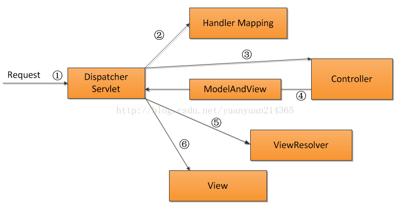

# Servlet

## Servlet的作用

Servlet带给我们最大的作用就是能够**处理浏览器带来HTTP请求，并返回一个响应给浏览器，从而实现浏览器和服务器的交互**。

## JAVAWEB目录结构

- bbs目录代表一个web应用
- bbs目录下的html,jsp文件可以直接被浏览器访问
- **WEB-INF目录下的资源是不能直接被浏览器访问的**
- web.xml文件是web程序的主要配置文件
- 所有的classes文件都放在classes目录下
- jar文件放在lib目录下

## Servlet生命周期

1. **加载Servlet**。

   当Tomcat第一次访问Servlet的时候，**Tomcat会负责创建Servlet的实例**

2. **初始化**。

   当Servlet被实例化后，Tomcat会**调用init()方法初始化这个对象**

3. **处理服务**。

   当浏览器**访问Servlet**的时候，Servlet **会调用service()方法处理请求**

4. **销毁**。

   当Tomcat关闭时或者检测到Servlet要从Tomcat删除的时候会自动调用destroy()方法，**让该实例释放掉所占的资源**。一个Servlet如果长时间不被使用的话，也会被Tomcat自动销毁

5. **卸载**。

   当Servlet调用完destroy()方法后，等待垃圾回收。如果**有需要再次使用这个Servlet，会重新调用init()方法进行初始化操作**。

> 只要访问Servlet，service()就会被调用。

> init()只有第一次访问Servlet的时候才会被调用。

> destroy()只有在Tomcat关闭的时候才会被调用。

## Servlet 内部请求过程

请求说明：

一个请求Request进来经过前端控制器Dispatcher Servlet，这是前端的核心。

一个请求的URL进来，经过Dispatcher Servlet转发，首先转发到Handler Mapping，

②Handler Mapping的作用就是完成对URL到Controller组件的映射，

然后通过Dispatcher Servlet从Handlermapping查找处理request的Controller。

③ controller处理request请求后并返回ModelAndView对象，

Controller是springmvc中负责处理request的组件，ModelAndView是封装结果视图的组件。其后面的步骤就是将视图结果返回给客户端。

总结：上图除了Dispatcherservlet以外其他的都是相互独立，所有请求都经过这个核心控制器进行转发控制。   

