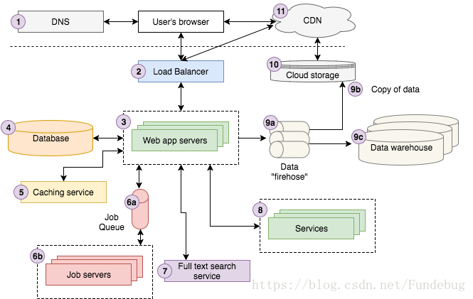

# 架构入门

## StoryBlocks架构示例

### 通过用户访问[Strong Beautiful Fog And Sunbeams In The Forest](https://www.storyblocks.com/stock-image/strong-beautiful-fog-and-sunbeams-in-the-forest-bxxg0dvxdzj6gt9ini)页面的处理过程来简单说明各个架构要素的作用：

- 当用户点击Strong Beautiful Fog And Sunbeams In The Forest访问我们的图片服务时，浏览器会先给DNS(域名解析服务)服务器发送请求，获取IP地址，然后再给Storyblocks服务器发送请求。
- 用户的请求会到达我们的Load Balancer(负载均衡服务)，Load Balancer会随机选择我们10个Web Application Server(网页应用服务)中的一个来处理这个请求。
- Web Application Server会先在Caching Service(缓存服务)读取图片信息，然后再从Database(数据库)中读取其他数据。
- 当Web Application Server发现图片的color profile(颜色分析)还没有计算时，会给Job Queue(任务队列)发送一个color profile任务。
- Job Server(任务服务)会从Job Queue中获取corlor profile任务进行异步计算，计算结束之后再更新数据库。
- Web Application Server会给search service(搜索服务)发送搜索请求，以图片的名字作为关键词，来查找类似的图片。
  如果用户恰好是登录状态，Web Application Server会去访问Account Service(账号服务器)来获取账号信息。
- Web Application Server会给data firehose(数据加载服务)发送一个Page View(网页浏览)事件，并把它记录到我们的Cloud Storage System(存储云)，最终加载到我们的Data Warehouse(数据仓库)中。数据分析师会通过Data Warehouse中的数据来分析我们的运行情况，辅助我们的商业决策。
- Web Application Server会渲染出HTML，并把它通过Load Balancer发送给用户的浏览器。页面中的JavaScript和CSS文件存储在我们的Cloud Storage System(存储云)中，并通过CDN进行分发。因此，用户的浏览器会直接访问CDN来获取JavaScript和CSS文件。
- 最后，浏览器再渲染整个页面给用户看。

