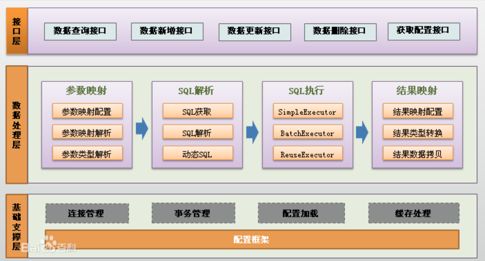
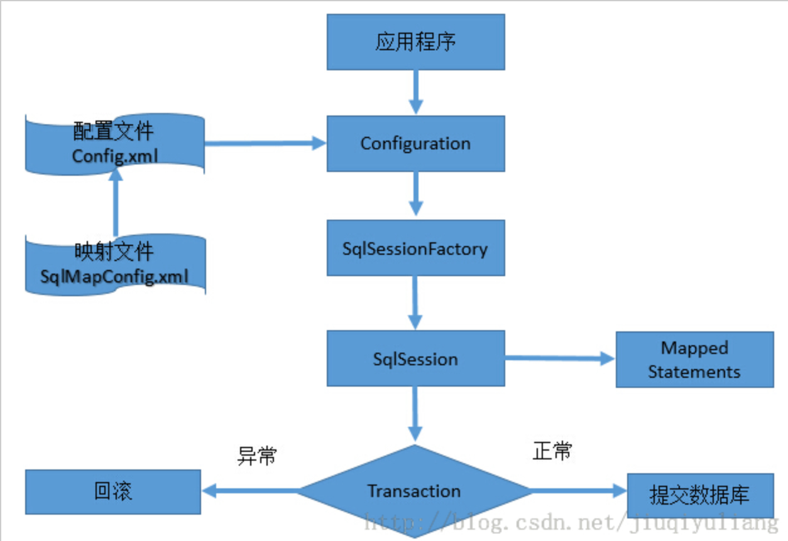

# mybatis

## 功能架构



## 原理详解



 MyBatis应用程序根据XML配置文件创建SqlSessionFactory，

SqlSessionFactory在根据配置，配置文件和Java代码的注解，获取一个SqlSession。

SqlSession包含了执行sql所需要的所有方法，

可以通过SqlSession实例直接运行映射的sql语句，

完成对数据的增删改查和事务提交等，用完之后关闭SqlSession。


## 注解开发

首先我们需要获取 **SqlSession**:

```java
SqlSession session = sqlSessionFactory.openSession(true);
```

参数设置为`true`表示开启自动提交模式

Session 在注解形式的使用方式如:

```java
ClusterMessage clusterMessage = new ClusterMessage();
clusterMessage.setClusterId(1);
clusterMessage.setClusterName("useName");
clusterMessage.setClusterTime(new Date().getTime());
clusterMessage.setClusterAddress("localhost");
clusterMessage.setClusterAccessUser("user");
clusterMessage.setClusterAccessPasswd("test");

session.getMapper(ClusterMessageMapper.class).updateClusterMessage(clusterMessage);
```

### 关键注解词

@Insert ： 插入sql , 和xml insert sql语法完全一样

@Select ： 查询sql, 和xml select sql语法完全一样

@Update ： 更新sql, 和xml update sql语法完全一样

@Delete ： 删除sql, 和xml delete sql语法完全一样

@Param ： 入参

@Results ： 结果集合

@Result ： 结果