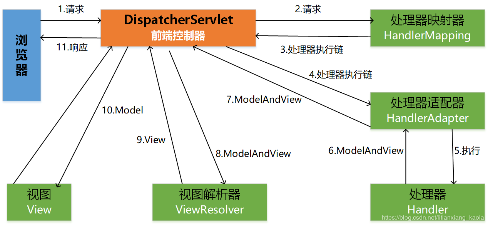

# SpringMVC

## 重要的概念

### DispatcherServlet

spring mvc的前端控制器，是所有请求处理的入口，它将请求分发给对应的controller。应用程序启动的时候，spring容器初始化DispatcherServlet时会收集各种配置信息初始化创建HandlerMapping实例。而DispatcherServlet就是根据HandlerMapping来找到对应的controller的。

### HandlerMapping

负责请求(request)/URL和请求处理者handler之间的映射关系(其实一般的spring web项目中Handler就是controller)。每个HandlerMapping实例的核心内容是一组URL pattern跟对应的handler的映射表（<URL pattern,Handler>）。再一个springweb应用中会有不止一个 HandlerMapping 实例，并且这些HandlerMapping可以排序。当一个请求到达时，Spring MVC会根据排好的顺序查找第一个匹配请求URL的HandlerMapping并结合所设置的pre/post Inteceptors构造一个 HandlerExecutionChain 对象用于处理该请求。

### HandlerAdapter

Handler适配器，DispatcherServlet不直接跟Handler进行交互，而是通过HandlerAdapter，Handler所有的处理业务的细节，DispatcherServlet一无所知，换句话说它只知道HandlerAdapter不知道Handler。

### Controller

控制器，处理请求生成相关业务数据的地方。

### HandlerInterceptor

用于handler调用的前/后或者请求处理完成时提供特定的逻辑，相当于过滤器。

对符合某些特征的请求应用一些特定的功能，就可以使用HandlerInterceptor。比如你想要求某些URL被访问时用于必须已经登录，你就可以实现一个检查用户是否已经登录的HandlerInterceptor。

HandlerInterceptor是一个接口，该接口定义了三个方法：

           preHandle() – 真正的 handler 执行之前被调用
           postHandle() – 真正的 handler 执行之后被调用
           afterCompletion() – 整个request被处理完成时调用

这三个方法提供了足够的灵活性用于进行各种预处理和后置处理

### HandlerExecutionChain

一个Handler加上一组HandlerInterceptor。

### ModelAndView

用来存储处理完后的结果数据。

### ViewResolver

视图解析器，把一个逻辑上的视图名称解析为一个真正的视图。

## 具体流程：

（1）首先浏览器发送请求——>DispatcherServlet，前端控制器收到请求后自己不进行处理，而是委托给其他的解析器进行处理，作为统一访问点，进行全局的流程控制；

（2）DispatcherServlet——>HandlerMapping，处理器映射器将会把请求映射为HandlerExecutionChain对象（包含一个Handler处理器对象、多个HandlerInterceptor拦截器）对象；

（3）DispatcherServlet——>HandlerAdapter，处理器适配器将会把处理器包装为适配器，从而支持多种类型的处理器，即适配器设计模式的应用，从而很容易支持很多类型的处理器；

（4）HandlerAdapter——>调用处理器相应功能处理方法，并返回一个ModelAndView对象（包含模型数据、逻辑视图名）；

（5）ModelAndView对象（Model部分是业务对象返回的模型数据，View部分为逻辑视图名）——> ViewResolver， 视图解析器将把逻辑视图名解析为具体的View；

（6）View——>渲染，View会根据传进来的Model模型数据进行渲染，此处的Model实际是一个Map数据结构；

（7）返回控制权给DispatcherServlet，由DispatcherServlet返回响应给用户，到此一个流程结束。

